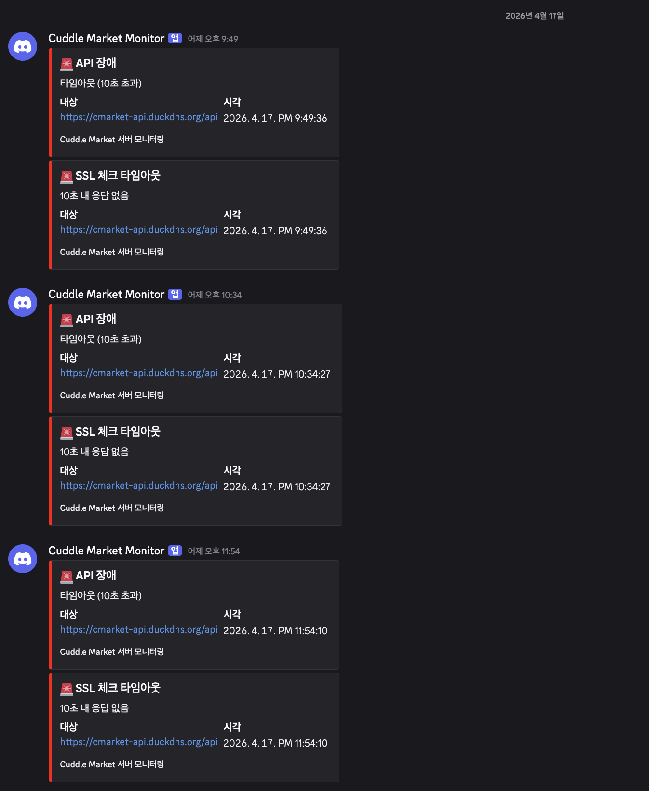
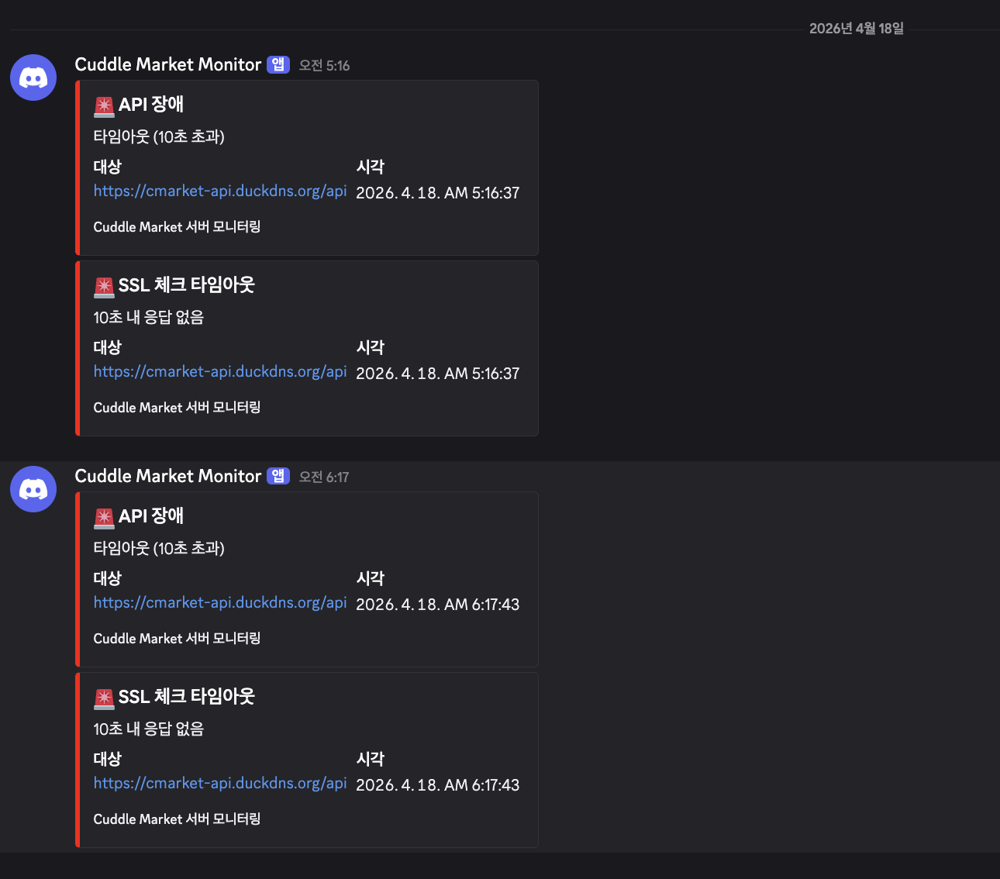

# "어라, 사이트가 안 열리네?" — GitHub Actions로 서버 모니터링 만든 이야기

> SSL 인증서 만료로 서비스가 죽은 걸 몰랐던 경험에서 출발해, GitHub Actions + 디스코드 웹훅으로 서버 장애 알림 시스템을 만든 이야기

---

## 내 사이트가 안 열린다

React와 Next.js 학습에 집중하느라 배포해둔 프로젝트를 한동안 안 들어가봤다. 오랜만에 접속해보니 페이지가 안 열렸다. 화면에는 "상품을 불러올 수 없습니다"라는 문구만 덩그러니.

"어라? 뭐지?" 싶어서 브라우저 콘솔을 열어봤다.

```
GET https://your-api.example.com/api/notifications/stream
net::ERR_CERT_DATE_INVALID
```

`ERR_CERT_DATE_INVALID` — **SSL 인증서가 만료**된 거였다. 백엔드 서버의 HTTPS 인증서 유효기간이 지나서 브라우저가 연결 자체를 거부하고 있었다. notification stream뿐 아니라 모든 API 호출이 다 실패하고 있었고, 그래서 상품 목록도 못 불러온 거였다.

백엔드에 인증서 갱신을 요청하면 해결될 문제긴 했다. 근데 한 가지 생각이 들었다.

**"내가 직접 들어가서야 알았잖아."**

만약 내가 오늘 접속 안 했으면? 유저가 먼저 장애를 겪고 이탈했을 거다. 서버 상태를 자동으로 감시하고, 문제가 생기면 알림을 받을 수 있어야 했다.

---

## 모니터링 방법 고르기

모니터링 시스템을 만드는 방법은 크게 두 가지가 있다.

### 1. 외부 서비스 (UptimeRobot, BetterStack 등)

설정만 하면 바로 사용 가능하고, SSL 만료 모니터링도 기본 제공된다. 빠르고 간편하다.

### 2. 직접 구축

헬스체크 스크립트를 작성하고, 스케줄러로 주기적으로 실행하며, 장애 감지 시 알림을 보내는 시스템을 직접 만든다.

학습 목적도 있었기에 **직접 구축**을 선택했다. 스케줄러로는 **GitHub Actions**를, 알림 채널로는 **디스코드 웹훅**을 선택했다.

#### 왜 GitHub Actions인가?

프로젝트가 이미 GitHub Actions를 사용하고 있었고(코드리뷰 자동화), 무료 한도가 넉넉했다.

| 체크 간격 | 월 실행 횟수 | 예상 소진 | 무료 한도(2,000분) 대비 |
| --------- | ------------ | --------- | ----------------------- |
| 30분      | ~1,440회     | ~24분     | **1.2%**                |
| 15분      | ~2,880회     | ~48분     | 2.4%                    |
| 5분       | ~8,640회     | ~144분    | 7.2%                    |

30분 간격이면 월 24분밖에 안 쓴다. 5분 간격으로 해도 7%다. Vercel Cron도 고려했지만, Hobby 플랜에서는 하루 1회만 가능해서 모니터링 용도로는 부족했다.

#### 왜 디스코드인가?

웹훅 URL 하나로 POST 요청만 보내면 되니까 가장 간단하다. 슬랙이나 이메일도 비슷한 방식으로 연동 가능하지만, 디스코드를 먼저 선택했다.

---

## 만들기

전체 구조는 이렇게 생겼다:

```
.github/
├── scripts/
│   └── health-check.mjs    ← 헬스체크 + 알림 로직
└── workflows/
    └── server-monitor.yml   ← 30분 간격 스케줄러
```

### 1. 헬스체크 스크립트

`.github/scripts/health-check.mjs`

두 가지를 체크한다:

- **API 응답 체크**: 서버에 GET 요청을 보내서, 응답이 오는지 확인
- **SSL 인증서 체크**: 인증서 만료일을 확인해서, 7일 이내면 경고

```js
import tls from 'node:tls'

// ============================================================
// Configuration
// ============================================================
const API_URL = 'https://your-api.example.com/api'
const HOST = 'your-api.example.com'
const TIMEOUT_MS = 10_000
const SSL_WARN_DAYS = 7
const SSL_DANGER_DAYS = 3
const DISCORD_WEBHOOK_URL = process.env.DISCORD_WEBHOOK_URL
```

설정값은 상단에 모아뒀다. `API_URL`과 `HOST`만 본인 서버에 맞게 바꾸면 된다.

#### API 응답 체크

```js
async function checkAPI() {
  const controller = new AbortController()
  const timer = setTimeout(() => controller.abort(), TIMEOUT_MS)

  try {
    const res = await fetch(API_URL, { signal: controller.signal })
    clearTimeout(timer)

    if (res.status < 500) {
      console.log(`[OK] API 서버 응답 정상 (${res.status})`)
      return null
    }
    return {
      type: 'API 장애',
      detail: `HTTP ${res.status} ${res.statusText}`,
      color: 0xff0000,
    }
  } catch (err) {
    clearTimeout(timer)
    const message = err.name === 'AbortError' ? `타임아웃 (${TIMEOUT_MS / 1000}초 초과)` : err.message
    return {
      type: 'API 장애',
      detail: message,
      color: 0xff0000,
    }
  }
}
```

`AbortController`로 10초 타임아웃을 건다. 응답이 5xx이면 장애, 그 외(200, 401, 404 등)는 "서버가 살아있다"로 판단한다.

처음에는 `res.ok`(200만 정상)로 판단했는데, 인증이 필요한 API 엔드포인트가 401을 반환하면서 잘못된 알림이 왔다. 모니터링의 목적은 **"서버가 살아있는가?"**이지 "API가 정상 응답하는가?"가 아니니까, `res.status < 500`으로 기준을 바꿨다.

#### SSL 인증서 체크

```js
function checkSSL() {
  return new Promise((resolve) => {
    let resolved = false
    const safeResolve = (val) => {
      if (resolved) return
      resolved = true
      socket.destroy()
      resolve(val)
    }

    const socket = tls.connect({ port: 443, host: HOST, servername: HOST, timeout: TIMEOUT_MS }, () => {
      const cert = socket.getPeerCertificate()

      if (!cert || !cert.valid_to) {
        safeResolve({
          type: 'SSL 인증서 오류',
          detail: '인증서 정보를 가져올 수 없습니다.',
          color: 0xff0000,
        })
        return
      }

      const expiryDate = new Date(cert.valid_to)
      const daysLeft = Math.floor((expiryDate - Date.now()) / (1000 * 60 * 60 * 24))

      if (daysLeft < 0) {
        safeResolve({
          type: 'SSL 인증서 만료',
          detail: `인증서가 이미 만료되었습니다. (만료일: ${cert.valid_to})`,
          color: 0xff0000,
        })
      } else if (daysLeft <= SSL_DANGER_DAYS) {
        safeResolve({
          type: 'SSL 인증서 위험',
          detail: `만료까지 ${daysLeft}일 남음 (만료일: ${cert.valid_to})`,
          color: 0xff0000,
        })
      } else if (daysLeft <= SSL_WARN_DAYS) {
        safeResolve({
          type: 'SSL 인증서 경고',
          detail: `만료까지 ${daysLeft}일 남음 (만료일: ${cert.valid_to})`,
          color: 0xffaa00,
        })
      } else {
        console.log(`[OK] SSL 인증서 정상 (만료까지 ${daysLeft}일)`)
        safeResolve(null)
      }
    })

    socket.setTimeout(TIMEOUT_MS)

    socket.on('error', (err) => {
      safeResolve({
        type: 'SSL 연결 오류',
        detail: err.message,
        color: 0xff0000,
      })
    })

    socket.on('timeout', () => {
      safeResolve({
        type: 'SSL 체크 타임아웃',
        detail: `${TIMEOUT_MS / 1000}초 내 응답 없음`,
        color: 0xff0000,
      })
    })
  })
}
```

Node.js의 `tls` 모듈로 서버에 직접 TLS 연결을 맺고, 인증서의 `valid_to` 필드에서 만료일을 가져온다. 만료까지 7일 이하면 경고(노란색), 3일 이하면 위험(빨간색), 이미 만료됐으면 즉시 알림을 보낸다.

여기서 `safeResolve` 패턴을 쓴 이유가 있다. 타임아웃이 발생하면 `socket.destroy()`를 호출하는데, 이때 `error` 이벤트도 함께 발생할 수 있다. 그러면 Promise가 두 번 resolve되는 문제가 생긴다. `resolved` 플래그로 한 번만 resolve되도록 보호한다.

#### 디스코드 알림 발송

```js
async function sendDiscord(embeds) {
  if (!DISCORD_WEBHOOK_URL) {
    console.error('[SKIP] DISCORD_WEBHOOK_URL이 설정되지 않았습니다.')
    return
  }
  try {
    await fetch(DISCORD_WEBHOOK_URL, {
      method: 'POST',
      headers: { 'Content-Type': 'application/json' },
      body: JSON.stringify({ embeds }),
    })
  } catch (err) {
    console.error('[ERROR] 디스코드 전송 실패:', err.message)
  }
}
```

디스코드 웹훅은 URL에 POST 요청을 보내면 끝이다. `embeds` 형식을 사용하면 제목, 색상, 필드 등을 구조화해서 보낼 수 있다. `try-catch`로 감싼 이유는, 웹훅 URL이 잘못되었거나 네트워크 장애가 있을 때 스크립트 전체가 크래시되는 걸 방지하기 위해서다.

#### 메인 함수

```js
async function main() {
  console.log(`\n===== 서버 모니터링 시작 (${nowKST()}) =====\n`)

  const [apiResult, sslResult] = await Promise.all([checkAPI(), checkSSL()])

  const problems = [apiResult, sslResult].filter(Boolean)

  if (problems.length === 0) {
    console.log('\n[결과] 모든 체크 통과 — 알림 없음\n')
    process.exit(0)
  }

  console.log(`\n[결과] ${problems.length}건의 문제 감지 — 디스코드 알림 발송\n`)

  const embeds = problems.map((p) => ({
    title: `🚨 ${p.type}`,
    description: p.detail,
    color: p.color,
    fields: [
      { name: '대상', value: API_URL, inline: true },
      { name: '시각', value: nowKST(), inline: true },
    ],
    footer: { text: 'Cuddle Market 서버 모니터링' },
  }))

  await sendDiscord(embeds)
  console.log('[알림] 디스코드 전송 완료')
  process.exit(1)
}

main()
```

API 체크와 SSL 체크를 `Promise.all`로 병렬 실행한다. 문제가 없으면 `exit(0)`으로 정상 종료하고, 문제가 있으면 디스코드로 알림을 보낸 뒤 `exit(1)`로 종료한다. `exit(1)`은 GitHub Actions에서 워크플로우를 "실패" 상태로 만들어서, Actions 탭에서도 장애를 확인할 수 있게 한다.

### 2. GitHub Actions 워크플로우

`.github/workflows/server-monitor.yml`

```yaml
name: Server Monitor

on:
  schedule:
    - cron: '*/30 * * * *'
  workflow_dispatch:

jobs:
  health-check:
    runs-on: ubuntu-latest
    steps:
      - name: Checkout
        uses: actions/checkout@v4

      - name: Setup Node.js
        uses: actions/setup-node@v4
        with:
          node-version: 24

      - name: Run health check
        env:
          DISCORD_WEBHOOK_URL: ${{ secrets.DISCORD_WEBHOOK_URL }}
        run: node .github/scripts/health-check.mjs
```

- `schedule: cron: '*/30 * * * *'` — 30분마다 자동 실행
- `workflow_dispatch` — Actions 탭에서 수동 실행 가능
- `DISCORD_WEBHOOK_URL`은 GitHub Secrets에서 주입

이게 전부다. 파일 2개, 외부 의존성 0개.

---

## 따라하기

코드는 위에서 다 보여줬으니, 이제 설정만 하면 된다.

### Step 1: 디스코드 웹훅 생성

1. 디스코드 앱에서 알림 받을 서버의 **채널**을 선택한다 (전용 채널을 만드는 걸 추천)
2. 채널 이름 옆 **톱니바퀴(설정)** 클릭
3. 왼쪽 메뉴에서 **연동** 클릭
4. **웹후크** → **새 웹후크** 클릭
5. 이름을 설정하고 (예: `Server Monitor`) **웹후크 URL 복사**

### Step 2: GitHub Secrets 등록

1. GitHub 레포 → **Settings** 탭
2. 왼쪽 메뉴 **Secrets and variables** → **Actions**
3. **New repository secret** 클릭
4. Name: `DISCORD_WEBHOOK_URL`
5. Secret: Step 1에서 복사한 URL 붙여넣기
6. **Add secret**

### Step 3: 수동 실행으로 테스트

1. GitHub 레포 → **Actions** 탭
2. 왼쪽에서 **Server Monitor** 워크플로우 선택
3. **Run workflow** → **Run workflow** 클릭
4. 실행 완료 후 디스코드 채널에 알림이 오는지 확인

정상이라면 알림이 오지 않는다 (문제가 있을 때만 알림). 테스트를 위해 `API_URL`을 존재하지 않는 주소로 바꿔보면 장애 알림을 확인할 수 있다.

---

## 삽질 기록

처음 작성한 코드에는 몇 가지 문제가 있었다. PR을 올리면 자동으로 AI 코드리뷰가 돌아가는데, 거기서 잡아준 것들이다.

### 1. Discord 웹훅 발송 실패 시 프로세스 크래시

**문제**: `sendDiscord()`에서 fetch 에러를 catch하지 않아서, 웹훅 URL이 잘못되면 unhandled rejection으로 프로세스가 죽었다.

**해결**: try-catch 추가.

### 2. TLS 연결 무한 대기

**문제**: `tls.connect()`에 타임아웃 설정이 없어서, DNS나 TCP 핸드셰이크 단계에서 무한정 블로킹될 수 있었다.

**해결**: connect 옵션에 `timeout`을 전달하고, `socket.setTimeout()`도 명시적으로 호출.

### 3. Promise 중복 resolve

**문제**: 타임아웃 발생 → `socket.destroy()` → error 이벤트 발생 → resolve가 두 번 호출될 수 있었다.

**해결**: `safeResolve` 패턴으로 한 번만 resolve되도록 보호.

### 4. API 응답 판단 기준 오탐

**문제**: `res.ok`(HTTP 200만 정상)로 판단했는데, 인증이 필요한 엔드포인트가 401을 반환하면서 "API 장애"로 오탐.

**해결**: `res.status < 500`으로 변경. 모니터링 목적은 "서버가 살아있는가?"이므로, 5xx과 연결 실패만 장애로 판단.

---

## 실제로 돌려보니

디스코드에 도착한 실제 알림 메시지는 이렇게 생겼다:

```
🚨 API 장애
HTTP 401

대상: https://your-api.example.com/api
시각: 2026. 4. 13. PM 9:12:23

Cuddle Market 서버 모니터링
```

(이건 판단 기준 수정 전이라 401도 장애로 잡힌 것이다. 수정 후에는 5xx만 알림이 온다.)

### 비용

| 항목                          | 값       |
| ----------------------------- | -------- |
| 체크 간격                     | 30분     |
| 월 실행 횟수                  | ~1,440회 |
| 월 사용 시간                  | ~24분    |
| GitHub Actions 무료 한도 대비 | **1.2%** |
| 외부 의존성                   | 0개      |
| 추가 파일                     | 2개      |

### 이전 vs 이후

|           | 이전                       | 이후                            |
| --------- | -------------------------- | ------------------------------- |
| 장애 인지 | 직접 접속해야 알 수 있었음 | 디스코드로 즉시 알림            |
| SSL 만료  | 만료되고 나서야 발견       | 7일 전에 경고                   |
| 비용      | -                          | 무료 (GitHub Actions 한도 1.2%) |

---

## 실전에서 터진 문제: 알림 폭주

모니터링을 배포하고 며칠 뒤, 자기 전에 디스코드를 확인했다. 알림이 와 있었다.

```
🚨 API 장애
타임아웃 (10초 초과)

🚨 SSL 체크 타임아웃
10초 내 응답 없음
```

백엔드 서버가 다운된 거였다. "오, 모니터링이 제대로 잡았네" 싶었는데, 아침에 일어나보니 상황이 달랐다.

**똑같은 알림이 16개 이상 쌓여 있었다.**





서버가 밤새 다운되어 있었고, 30분마다 동일한 장애 알림이 반복 발송된 것이다. 4/17 PM 9:49부터 4/18 AM 6:17까지, 약 8시간 동안.

모니터링은 잘 동작한 거지만, 쓸모없는 반복 알림이 디스코드 채널을 도배했다. 그리고 하나 더 — 서버가 언제 복구됐는지 알 수 없었다. 장애 알림만 있고, 복구 알림은 없었으니까.

---

## 개선하기

### 문제 정의

1. **알림 폭주**: 장애가 지속되면 30분마다 동일 알림 반복
2. **복구 시점 불명**: 장애가 끝나도 알 수 없음

### 해결 방향

- 첫 장애 감지 시 즉시 알림
- 장애 지속 중에는 **3시간 간격**으로만 리마인더 발송
- 서버 복구 시 **복구 알림** 발송 (장애 지속 시간 포함)

핵심은 **"이전 실행의 결과를 기억하는 것"**이다. 그런데 GitHub Actions는 실행 간 상태가 없다. 각 실행은 깨끗한 환경에서 시작되니까.

### 상태 저장: GitHub Actions Cache

상태를 저장할 곳이 필요했다. 데이터베이스를 붙이면 과하고, 외부 서비스를 쓰면 의존성이 생긴다. GitHub Actions에는 **Cache**라는 기능이 있다. 빌드 캐시 용도로 설계됐지만, 작은 JSON 파일 하나 저장하는 데도 쓸 수 있다.

```json
{
  "status": "alerting",
  "firstAlertAt": "2026-04-17T12:49:36.000Z",
  "lastAlertAt": "2026-04-17T12:49:36.000Z",
  "alertCount": 1
}
```

`alert-state.json` 파일 하나에 장애 상태를 기록한다. `status`가 `"ok"`이면 정상, `"alerting"`이면 장애 진행 중.

#### 워크플로우 수정

```yaml
- name: Restore alert state
  uses: actions/cache/restore@v4
  with:
    path: .github/scripts/alert-state.json
    key: alert-state-${{ github.run_id }}
    restore-keys: alert-state-

- name: Run health check
  env:
    DISCORD_WEBHOOK_URL: ${{ secrets.DISCORD_WEBHOOK_URL }}
    ALERT_STATE_PATH: .github/scripts/alert-state.json
  run: node .github/scripts/health-check.mjs

- name: Save alert state
  if: always()
  uses: actions/cache/save@v4
  with:
    path: .github/scripts/alert-state.json
    key: alert-state-${{ github.run_id }}
```

헬스체크 실행 전에 이전 상태를 복원하고, 실행 후에 새 상태를 저장한다. `if: always()`로 헬스체크가 실패(exit 1)해도 상태는 반드시 저장한다.

`restore-keys: alert-state-`가 핵심이다. GitHub Actions Cache는 키가 정확히 일치하지 않으면 접두사가 일치하는 가장 최근 캐시를 가져온다. 매번 `alert-state-{run_id}`로 새 키를 만들지만, 복원할 때는 이전 실행의 캐시를 가져오는 것이다.

### 스크립트 수정

#### 상태 관리 함수

```js
import fs from 'node:fs';

const ALERT_STATE_PATH = process.env.ALERT_STATE_PATH || '.github/scripts/alert-state.json';
const SUPPRESS_HOURS = 3;

function readState() {
  try {
    return JSON.parse(fs.readFileSync(ALERT_STATE_PATH, 'utf-8'));
  } catch {
    return { status: 'ok', firstAlertAt: null, lastAlertAt: null, alertCount: 0 };
  }
}

function writeState(state) {
  fs.writeFileSync(ALERT_STATE_PATH, JSON.stringify(state, null, 2));
}
```

파일이 없으면 `status: 'ok'`로 시작한다. 첫 실행이니까.

#### 분기 로직

메인 함수에서 체크 결과와 이전 상태를 조합해 4가지 경우를 처리한다:

| 이전 상태 | 체크 결과 | 동작 |
| --------- | --------- | ---- |
| ok | 정상 | 아무것도 안 함 |
| ok | 장애 | 첫 알림 발송 → alerting으로 전환 |
| alerting | 장애 | 3시간 경과 시 리마인더, 아니면 SKIP |
| alerting | 정상 | **복구 알림 발송** → ok로 전환 |

```js
// 장애 지속 중 — 억제 판단
const hoursSinceLastAlert = (now - new Date(state.lastAlertAt).getTime()) / (1000 * 60 * 60);

if (hoursSinceLastAlert >= SUPPRESS_HOURS) {
  // 3시간 경과 → 리마인더 발송
  const duration = formatDuration(now - new Date(state.firstAlertAt).getTime());
  // "🔔 API 장애 (지속 중) — 장애 지속 시간: 6시간 30분"
} else {
  console.log(`[SKIP] 알림 억제 중`);
}
```

#### 복구 알림

```js
if (problems.length === 0 && state.status === 'alerting') {
  const duration = formatDuration(now - new Date(state.firstAlertAt).getTime());
  await sendDiscord([{
    title: '✅ 서버 복구',
    description: '모든 서비스가 정상 응답합니다.',
    color: 0x00ff00, // 초록색
    fields: [
      { name: '대상', value: API_URL, inline: true },
      { name: '장애 지속 시간', value: duration, inline: true },
      { name: '복구 시각', value: nowKST(), inline: false },
    ],
  }]);
}
```

장애가 끝나면 초록색 임베드로 복구 알림을 보낸다. 장애가 얼마나 지속됐는지도 함께 표시한다.

### 백엔드 피드백 반영

개선을 배포하고 백엔드 팀원에게 장애 원인 확인을 요청했다. 원인 분석과 함께 모니터링 설정에 대한 피드백이 돌아왔다.

#### 장애 원인: 인프라 레이어

API 타임아웃과 SSL 타임아웃이 **동시에** 발생했다는 게 핵심 단서였다. `checkAPI()`는 HTTPS fetch, `checkSSL()`은 포트 443에 raw TLS 소켓 연결인데, 둘 다 실패했다는 건 **TCP 핸드셰이크 자체가 안 됐다**는 뜻이다. Spring Boot 앱 문제였다면 HTTP 5xx가 왔을 거다. 결론: EC2 호스트나 Nginx Proxy Manager 레벨의 일시적 불능이었고, 앱 코드 문제는 아니었다.

#### 피드백 1: 헬스체크 엔드포인트 변경

백엔드 피드백에서 중요한 지적이 있었다. 기존에 찌르던 `/api` 경로는 **실제 핸들러가 없는 경로**였다. 모든 컨트롤러가 `/api/auth`, `/api/products` 등으로 매핑되어 있어서, `/api`는 항상 404를 반환했다. `res.status < 500` 로직 덕에 404도 "정상"으로 통과시켜 온 것이다.

`/actuator/health`로 바꾸면 진짜 앱 상태를 확인할 수 있다. Spring Boot Actuator의 헬스체크 엔드포인트로, DB 연결까지 확인해서 `{"status":"UP"}` 또는 `{"status":"DOWN"}`을 반환한다. 이미 `permitAll`로 열려 있어서 백엔드 수정도 필요 없었다.

```js
const HEALTH_URL = 'https://cmarket-api.duckdns.org/actuator/health';

async function checkAPI() {
  // ...
  const res = await fetch(HEALTH_URL, { signal: controller.signal });
  if (res.ok) {
    const body = await res.json();
    if (body.status === 'UP') {
      console.log(`[OK] API 서버 응답 정상 (${res.status}, status: UP)`);
      return null;
    }
    return { type: 'API 장애', detail: `Actuator 상태: ${body.status}` };
  }
  // ...
}
```

#### 피드백 2: 체크 간격 + 연속 실패

30분 주기에 1회 실패로 바로 알림이 나가면, 50분짜리 일시적 네트워크 블립도 장애로 잡힌다. 백엔드에서 "5분 간격 2회 연속 실패"를 제안했고, 비용을 고려해 **10분 간격 2회 연속 실패**로 결정했다.

| 간격 | 감지 속도 | 월 비용 |
| ---- | --------- | ------- |
| 5분  | 10분      | 7.2%    |
| **10분** | **20분** | **3.6%** |
| 15분 | 30분      | 2.4%    |

10분이 감지 속도와 비용의 균형이 가장 좋았다. 15분은 기존 30분 1회 실패와 감지 속도가 동일해서 개선 체감이 없고, 5분은 비용 대비 이득이 적었다.

```js
const CONSECUTIVE_FAILURES_THRESHOLD = 2;

// 1회 실패: 알림 보류, 상태만 기록
if (state.status === 'ok' && consecutiveFailures < CONSECUTIVE_FAILURES_THRESHOLD) {
  console.log(`[대기] 연속 ${consecutiveFailures}/${CONSECUTIVE_FAILURES_THRESHOLD}회 (알림 보류)`);
  writeState({ ...state, consecutiveFailures });
  process.exit(1);
}
```

1회 실패 시에는 `consecutiveFailures`만 1로 올리고 알림을 보내지 않는다. 10분 뒤 다시 실패하면 그때 알림을 발송한다. 정상 응답이 오면 카운터는 0으로 리셋된다.

"타임아웃 10초는 보존하되 cold start 직후라면 더 관대하게"라는 피드백도 있었는데, 별도 처리 없이 2회 연속 실패 로직이 자연스럽게 커버한다. 서버 재시작 직후 1회 타임아웃 → 10분 뒤 부팅 완료 → 정상 응답 → 알림 안 감. cold start가 20분 이상 걸린다면 그건 그 자체로 장애다.

### 최종 비교

|           | 초기 버전                      | 최종 버전                            |
| --------- | ------------------------------ | ------------------------------------ |
| 엔드포인트 | `/api` (핸들러 없음, 404 통과) | `/actuator/health` (앱 상태 반영)    |
| 체크 간격 | 30분                           | 10분                                 |
| 알림 조건 | 1회 실패 즉시                  | 2회 연속 실패 (20분 지속 시)         |
| 장애 알림 | 30분마다 반복 (8시간 = 16건)   | 첫 알림 + 3시간 간격 리마인더 (3건)  |
| 복구 인지 | 직접 확인해야 알 수 있었음     | 복구 시 자동 알림 (지속 시간 포함)   |
| 상태 관리 | 없음 (매 실행이 독립적)        | GitHub Actions Cache로 상태 유지     |
| 월 비용   | 24분 (1.2%)                    | 72분 (3.6%)                          |

---

## 끝으로

"모니터링 없는 서비스는 장애를 유저가 알려준다"라는 말이 있다. 이번에 딱 그 상황을 겪었다. SSL 인증서 만료처럼 **예측 가능한 장애**는 미리 감지할 수 있고, 서버 다운 같은 **예측 불가능한 장애**도 20분 안에 알 수 있게 되었다.

처음에는 파일 2개로 시작했지만, 실전에서 부딪히면서 알림 중복 억제, 복구 알림, 헬스체크 정확도, 오탐 방지까지 점진적으로 개선했다. 백엔드 팀원의 피드백이 없었다면 핸들러 없는 경로를 계속 찔러대고 있었을 거다.

UptimeRobot 같은 서비스를 쓰면 더 빠르게 설정할 수 있지만, 직접 만들어보니 모니터링 시스템이 어떻게 동작하는지 이해할 수 있었다. Node.js의 `tls` 모듈로 SSL 인증서를 직접 파싱하는 것도, 디스코드 웹훅의 Embed 형식도, GitHub Actions Cache를 상태 저장소로 쓰는 것도 처음 해봤다.

파일 2개, 외부 의존성 0개, GitHub Actions 무료 한도 3.6%로 서버 모니터링을 구축할 수 있다. 배포해두고 잊고 있는 프로젝트가 있다면, 한번 만들어보는 걸 추천한다.
