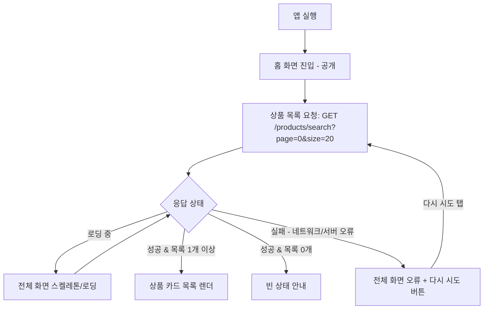

# 커들마켓 RN 앱 - "홈 슬라이스" 요구사항 정의서

작성일: 2026-07-21
작성 역할: PM (AI 협업팀 실습)
문서 성격: 요구사항/기획 (구현 코드 아님)

## 0. 이 문서를 읽는 순서와 상위 문서

이 문서는 아래 상위 문서(SSOT)를 따르며, 충돌 시 위 문서가 이깁니다.

1. `docs/project-analysis/2026-07-20-master-prd-draft.md` (정책 최상위)
2. `docs/project-analysis/2026-07-21-app-ia-draft.md` (정보구조)
3. `docs/project-analysis/2026-07-20-screen-functional-spec.md` (화면별 기능, §1 홈)
4. `docs/project-analysis/2026-07-21-mobile-ui-ux-guide.md` (모바일 UX 기준)
5. `docs/project-analysis/2026-07-20-web-project-analysis.md` (웹 근거)

참고 설계: `docs/superpowers/specs/2026-07-19-rn-app-monorepo-design.md`

---

## 1. 이 슬라이스의 목적과 사용자 가치

**목적(개발 관점):** "웹 → 앱" 파이프라인을 아주 작게 한 바퀴 도는 것. 기능 완성도가 아니라 **경로 검증**이 목적입니다. 즉 "백엔드 REST 실데이터를 받아 → 폰 화면에 상품 목록을 그린다"는 한 줄이 실제로 동작하는지 확인하는 첫 수직 슬라이스입니다.

**사용자 가치(제품 관점):** 사용자는 앱을 켜면 **로그인 없이도** 지금 올라온 중고 반려동물용품을 바로 훑어볼 수 있습니다. (거래의 첫 관문 = "뭐가 있나 구경".)

> 이 슬라이스는 "구경까지"만 책임집니다. 필터·상세 이동·등록 같은 다음 행동은 다음 루프입니다.

---

## 2. 슬라이스 범위 (못박음)

### 2.1 포함 (IN)

- 홈 상품 목록 화면을 **백엔드 REST 실데이터**로 폰에 렌더한다.
- 상품 **카드 기본 표시** (썸네일·제목·가격 등, §4 참고).
- **로딩 / 빈 / 오류** 세 가지 상태 처리 (모바일 UX 가이드 §6 기준, §5 참고).
- **로그인 없이 조회** (홈은 `(public)` 영역).
- **무한스크롤**: 목록을 끝까지 내리면 다음 페이지를 자동 로드(`page` 증가, `hasNext`로 종료). 웹 홈과 동일한 데이터층(**TanStack Query `useInfiniteQuery`**)을 앱에도 적용. (스코프 조정 2026-07-22 — 중고거래 피드의 핵심 UX라 IN으로 승격.)

### 2.2 제외 (OUT) — 다음 루프로 분리

| 제외 항목 | 이유 / 어디로 |
| --- | --- |
| 상세 필터(가격·지역·상품상태 등) 열기/초기화 | 다음 루프 |
| 펫 유형 탭 / 카테고리 탭 / 상품유형(판매·판매요청) 탭 | 다음 루프 |
| 정렬(sortBy/sortOrder) 변경 UI | 다음 루프 |
| 상품 카드 클릭 → 상품 상세 이동 | 다음 루프 |
| 상품 등록 CTA(+버튼) | 다음 루프 (로그인 필요 동작) |
| 찜(하트) 누르기 = 찜 토글 | 다음 루프 (로그인 필요 동작). **카드에 찜 개수 숫자는 표시**하되, 누르는 동작은 안 함 |
| 인증 가드 / 로그인 모달 | 홈은 공개 화면이라 이 슬라이스에 없음 |
| 하단 5탭 네비게이션 전체 | 홈 탭 화면 하나만. 탭 바 완성은 다음 루프 |

> 근거: 화면명세 §1 "사용자 액션"에는 탭 변경·필터·무한스크롤·카드 클릭·등록 이동이 모두 있으나, 이 슬라이스는 그중 **표시(read)만** 남기고 나머지 상호작용을 뒤로 뺐습니다.

---

## 3. 사용자 플로우차트



텍스트 설명:

1. 앱을 켜면 곧바로 홈(상품 목록) 화면으로 들어간다. 로그인 확인 단계 없음.
2. 화면이 뜨는 즉시 REST로 첫 페이지 상품을 요청한다.
3. 응답을 받기 전까지는 **로딩 상태**(전체 화면 스켈레톤).
4. 성공하면 목록이 1개 이상이면 **카드 목록**, 0개면 **빈 상태**.
5. 요청이 실패하면 **오류 상태**(전체 화면 + "다시 시도"). 다시 시도를 누르면 3번으로 돌아간다.

---

## 4. 표시 데이터 항목 (상품 카드)

근거: 웹 `src/components/product/ProductCard.tsx`가 실제로 꺼내 쓰는 필드 + 상품 타입 `src/types/product.ts`의 `Product`.

| 카드 표시 요소 | 데이터 필드 (`Product`) | 비고 |
| --- | --- | --- |
| 썸네일 이미지 | `mainImageUrl` | CDN 이미지. RN에서는 `Image`/`expo-image`로 표시 |
| 상품 제목 | `title` | |
| 가격 | `price` (숫자) | "원" 단위로 포맷 |
| 등록 시각 | `createdAt` | 상대시간("3시간 전") 표기 권장 |
| 찜 개수 | `favoriteCount` | **숫자 표시만**. 누르는 토글은 OUT(§2.2) |
| 판매 유형 뱃지 | `productType` | "판매 / 판매요청"으로 변환해 표시 |
| 거래 상태 뱃지(썸네일 오버레이) | `tradeStatus` | "판매중/예약중/판매완료" 등. `null` 가능. 표시 규칙은 §4.1 참고 |
| 상품 상태 | `productStatus` | "새상품/거의새것" 등 코드 → 이름 변환 |
| 위치 | `addressGugun` 우선, 없으면 `addressSido` | 둘 다 없으면 빈 문자열 |

> **펫 종류(`petDetailType`)는 카드에 표시하지 않는다.** 웹 카드도 펫 종류를 화면에 안 그린다(근거: `src/components/product/components/ProductInfo.tsx` — 펫 종류를 prop으로 받지도 렌더하지도 않음. `getPetTypeName`은 접근성용 aria-label에만 쓰임). 이 슬라이스에서도 제외. (초기 표에 잘못 포함됐던 항목 — 이해관계자 피드백 + 코드 확인으로 제거.)

주의:

- `productType`·`tradeStatus`·`productStatus`는 **서버가 코드값**(예: `SELL`, `SELLING`, `USED`)으로 주고, 웹은 `getProductType`/`getTradeStatus`/`getProductStatus` 같은 변환 유틸로 사람이 읽는 이름으로 바꿉니다. 앱도 같은 매핑 규칙이 필요합니다. (이 슬라이스에서는 최소한 제목·가격·이미지만 정확히 나와도 "경로 검증" 목적은 달성. 코드→이름 변환은 있으면 좋고, 없으면 코드 그대로 보여도 됨 → 다음 루프에서 다듬기.)
- `isFavorite`는 로그인 사용자별 값입니다. 비로그인 조회에서는 하트 채움 상태만 참고하고, **토글 동작은 이 슬라이스에서 안 함**.

### 4.1 거래 상태 뱃지 = 썸네일 위 오버레이 (표시 규칙 못박음)

근거: 웹 `src/components/product/components/ProductThumbnail.tsx` (라벨 변환 line 41~50, 오버레이 렌더 line 92~98).

이건 별도 뱃지 칩이 아니라 **썸네일 이미지 위에 덮는 오버레이**입니다. "상태 뱃지 표시" 범위 안의 세부 규칙이라 스코프 확장이 아닙니다.

**1단계 — 서버 코드값 → 라벨 변환:**

| 서버 `tradeStatus` | 라벨 | 판매요청 상품(`productType=REQUEST`)일 때 예외 |
| --- | --- | --- |
| `SELLING` | 판매중 | (동일) |
| `RESERVED` | 예약중 | (동일) |
| `COMPLETED` | 판매완료 | → **요청완료** |
| `null`(없음) | (없음) | → **요청중** |

**2단계 — 라벨에 따른 썸네일 오버레이 표시:**

| 상태(라벨) | 오버레이 | 스크림(어둡게) | 중앙 pill |
| --- | --- | --- | --- |
| 판매중 (SELLING) | **없음** | — | — (썸네일 위에 아무것도 안 보임) |
| 요청중 (판매요청+상태없음) | **없음** | — | — |
| 예약중 (RESERVED) | **표시** | 이미지 전체 `bg-black/40` | 흰색 pill "예약중" |
| 판매완료 (COMPLETED) | **표시** | `bg-black/60` | 흰색 pill "판매완료" |
| 요청완료 (판매요청+COMPLETED) | **표시** | `bg-black/60` | 흰색 pill "요청완료" |

정리: **예약중은 살짝 어둡게(black/40), 완료 계열은 더 어둡게(black/60)**, 그 위 중앙에 흰색 라운드 pill로 상태 글자. 판매중/요청중은 오버레이 자체가 없습니다.

> 정확한 시각 값(색·크기·위치·타이포)은 **C2 디자이너가 상세화**합니다. 여기서는 "언제 오버레이를 씌우고 안 씌우는지 + 어두움 정도 2단계 + pill 라벨"까지만 못박습니다.

---

## 5. 상태 처리 (로딩 / 빈 / 오류)

기준: 모바일 UX 가이드 §6(상태 표현) + Master PRD §5.3(오류 UX 정책).

### 5.1 로딩 상태

- **첫 진입 로딩이므로 화면 전체 스켈레톤(또는 전체 로딩 상태)** 사용. (UX 가이드 §6.1: 첫 진입 로딩 = 전체 스켈레톤)
- 웹은 hydration 전 `HomeLoadingState`, 데이터 로드 중 스켈레톤을 씀(화면명세 §1). 앱도 같은 취지로 "빈 화면 멍 때림" 없이 뼈대를 먼저 보여준다.
- 무한 스피너 방치 금지. 네트워크가 오래 걸리면 오류 분기로 넘어갈 수 있게 한다(§5.3).

### 5.2 빈 상태 (성공했으나 목록 0개)

- 목록이 0개인 이유와 다음 행동을 짧게 안내. (UX 가이드 §6.2)
- 이 슬라이스엔 필터가 없으므로 "등록된 상품이 없습니다" 성격의 담백한 문구면 충분.
- 오류와 **명확히 구분**한다(빈 상태 ≠ 오류). 성공 응답인데 `content`가 빈 배열이면 빈 상태.

### 5.3 오류 상태 (요청 실패)

- 첫 로드가 실패해 **보여줄 콘텐츠가 아예 없으므로 전체 화면 오류**를 쓴다. (UX 가이드 §6.3 / PRD §5.3: 화면 첫 로드 실패 = 인라인 또는 전체 화면 오류. 홈은 핵심 콘텐츠 전체가 비므로 전체 화면 오류가 맞음)
- **"다시 시도" 버튼**을 함께 제공하고, 누르면 재요청한다.
- 불변 규칙: 이미 렌더된 목록이 있는 상태에서의 갱신 실패는 전체 화면 오류로 덮지 않는다. (이 슬라이스는 첫 로드만 있어 해당 없음 — 다음 루프의 새로고침/추가로드에서 지켜야 할 규칙으로 메모)

---

## 6. REST 데이터 소스 확인 결과 (핵심 리스크)

### 6.1 리스크 요약과 결론

- **리스크:** PRD §5.6은 "앱 = REST 단일화"인데, 웹 홈 클라이언트는 GraphQL(`/api/graphql`)로 상품을 받는다(웹 분석 §8.2, `src/features/home/Home.tsx`가 `fetchGraphQL` 사용). → 웹 홈 코드를 그대로 못 씀.
- **확인 결과: REST 엔드포인트가 있다. 앱은 이걸 직접 부르면 된다.**
  - 웹의 GraphQL BFF는 겉껍데기일 뿐, **그 안에서 실제로 Spring REST `/products/search`를 호출**한다. 근거: `src/lib/api/server/products.ts`의 `fetchProducts()`가 `fetch(\`${API_BASE_URL}/products/search?...\`)`를 호출.
  - 즉 앱은 GraphQL을 거치지 않고 **같은 REST 엔드포인트를 직접** 부르면 되고, 이는 PRD §5.6("Spring Boot REST 직접 호출") 정책과 정확히 일치.

### 6.2 사용할 엔드포인트 (확인됨)

- **요청:** `GET {NEXT_PUBLIC_API_BASE_URL}/products/search?page=0&size=20`
  - base URL: `https://cmarket-api.duckdns.org/api` (프로젝트 CLAUDE.md `.env.local` 기준)
  - 최종 예: `GET https://cmarket-api.duckdns.org/api/products/search?page=0&size=20`
- **이 슬라이스에서 쓰는 쿼리 파라미터:** `page`, `size` 만.
  - (그 외 `keyword`, `petType`, `petDetailType`, `productType`, `productStatuses`, `minPrice`, `maxPrice`, `addressSido`, `addressGugun`, `categories`, `sortBy`, `sortOrder`는 서버가 받지만 **이 슬라이스에서는 안 씀** — 필터/정렬은 OUT.)
- **응답 형태(확인됨, `src/types/product.ts`의 `ProductResponse`):**

```jsonc
{
  "code": "SUCCESS",   // 라이브 검증 결과: 객체가 아니라 문자열 "SUCCESS"
  "message": "...",
  "data": {
    "page": 0,
    "size": 20,
    "total": 123,
    "content": [ /* Product[] — §4의 필드들 */ ],
    "totalPages": 7,
    "hasNext": true,
    "hasPrevious": false,
    "totalElements": 123,
    "numberOfElements": 20
  }
}
```

- 목록은 `data.content` (배열), 총 개수는 `data.totalElements`.
- `Product` 한 건의 필드는 §4 표 참고.

### 6.3 백엔드 확인 결과 (라이브 실호출로 검증됨 — 2026-07-21)

리드가 `GET https://cmarket-api.duckdns.org/api/products/search?page=0&size=20`를 **토큰 없이** 실제 호출해 확인함.

1. **비로그인 접근 허용 여부:** ✅ **확인됨(해소).** HTTP **200**으로 상품 **20건 실제 반환**(`totalElements`=50). 토큰 없이 조회 가능 = 홈이 공개 화면이라는 이 슬라이스 전제 확정.
2. **비로그인 시 `isFavorite` 기본값:** ✅ **확인됨(해소).** 토큰 없을 때 각 상품 `isFavorite: false`로 옴. → 카드 하트를 "빈 하트"로 그리면 됨.
3. **성공/오류 규약:** ✅ **확인됨(정정).** 성공 응답의 `code`는 `{ code: 200 }` 객체가 **아니라 문자열 `"SUCCESS"`**임(§6.2 예시 JSON 정정 반영). **성공/오류 판정은 HTTP status 기준**으로 한다(권장대로, 웹 `server/products.ts`도 `res.ok`만 씀).
   - 참고: 타입 파일 `src/types/product.ts`의 `ProductResponse.code`는 `{ code:number; message:string }`로 선언돼 있으나 **실 응답은 문자열** — 웹 타입과 실제가 어긋나 있음. 앱에서는 실 응답(문자열) 기준으로 다루고, `code` 값에 로직을 의존하지 말고 HTTP status로 판정.
4. **CDN 이미지 URL 규약:** ✅ **확인됨.** `mainImageUrl`은 **완성형 절대 URL**(CloudFront `.webp`)로 옴 → 그대로 `<Image>`에 넣으면 됨. 리사이즈 사이즈(150/400/800) 규칙 활용은 **성능 최적화용, 이 슬라이스에서는 비차단(다음 루프)** — 원본 URL 그대로 사용해도 무방.

→ 이 슬라이스의 REST 데이터 소스는 **막힘 없음(blocker 없음)**. 위 4건 모두 라이브로 확정.

---

## 7. 완료 기준 (Definition of Done)

체크 가능한 항목으로. 이 슬라이스는 아래가 **모두** 참이면 완료.

- [ ] 앱을 실행하면 별도 로그인 없이 홈(상품 목록) 화면이 뜬다.
- [ ] 홈 진입 시 `GET {base}/products/search?page=0&size=20`를 **실제 백엔드**로 호출한다. (목업/더미 아님)
- [ ] 응답의 `data.content` 상품들이 **폰 화면에 카드로** 그려진다.
- [ ] 각 카드에 최소 **썸네일(`mainImageUrl`) · 제목(`title`) · 가격(`price`)** 이 정확히 표시된다.
- [ ] **로딩 상태**: 응답 전 전체 화면 스켈레톤/로딩이 보인다.
- [ ] **빈 상태**: `content`가 빈 배열이면 "상품 없음" 안내가 보인다(오류 아님).
- [ ] **오류 상태**: 요청 실패 시 전체 화면 오류 + "다시 시도" 버튼이 보이고, 누르면 재요청된다.
- [ ] 위 세 상태가 서로 **구분**된다(빈 상태를 오류로, 오류를 로딩으로 섞지 않음).
- [ ] **무한스크롤**: 목록을 끝까지 내리면 다음 페이지가 자동 로드되고(하단 "더 불러오는 중"), `hasNext=false`면 멈춘다.
- [ ] 실제 폰(또는 시뮬레이터)에서 눈으로 목록이 확인된다. (게이트: 빌드/타입체크 통과 = 약한 게이트, **실기기 렌더 확인 = 강한 게이트.** 강한 게이트로 마무리)

> 참고(검증 방법): 모바일 확인 시 USB 연결(Chrome DevTools/Safari Web Inspector) 또는 Expo Go/시뮬레이터로 실제 렌더를 눈으로 확인. "빌드 됐다"만으로 완료 판정하지 않는다.

명시적으로 **완료 기준이 아닌 것**: 필터 동작, 상세 이동, 등록 버튼, 찜 토글, 하단 탭 전환. (§2.2 OUT)

---

## 8. 근거 파일 (추적용)

- 정책: `docs/project-analysis/2026-07-20-master-prd-draft.md` (§5.6 REST 단일화, §5.3 오류 UX)
- 정보구조: `docs/project-analysis/2026-07-21-app-ia-draft.md` (§3 `(public)/index`=홈, §7 공개 영역)
- 화면 기능: `docs/project-analysis/2026-07-20-screen-functional-spec.md` (§1 홈 화면)
- 모바일 UX: `docs/project-analysis/2026-07-21-mobile-ui-ux-guide.md` (§6 상태 표현, §9.1 리스트 화면)
- 웹 홈이 GraphQL 사용: `src/features/home/Home.tsx` (`fetchGraphQL`)
- GraphQL BFF가 실제로 REST 호출: `src/lib/api/server/products.ts` (`fetch(.../products/search)`)
- 응답/상품 타입: `src/types/product.ts` (`ProductResponse`, `Product`)
- 카드 표시 필드: `src/components/product/ProductCard.tsx`
- REST 인스턴스/베이스URL: `src/lib/api/api.ts` (`NEXT_PUBLIC_API_BASE_URL`)
